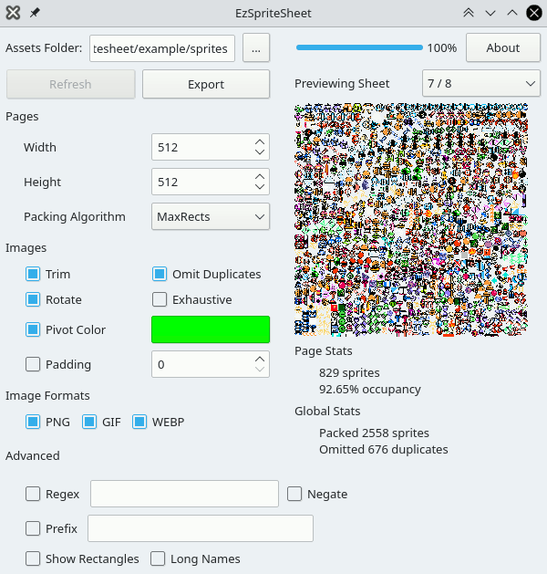
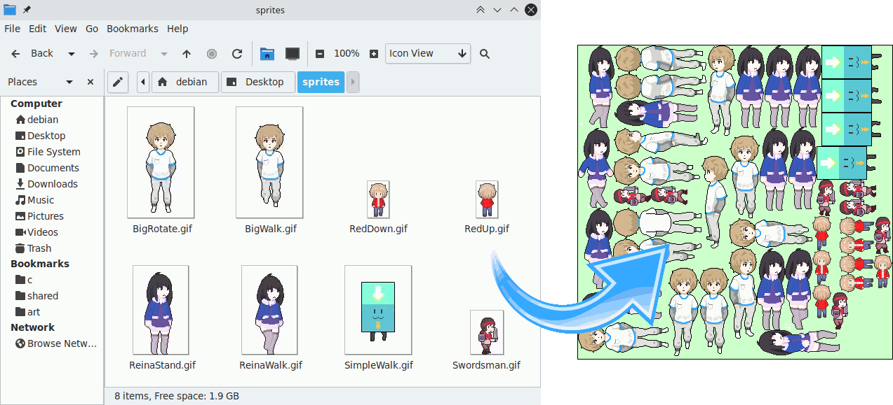

# EzSpriteSheet

Creating sprite sheets has never been easier: toss a folder at it and watch magic happen!

## Features

EzSpriteSheet is more feature-rich than its competition:

| Feature                                  | TexturePacker           | EzSpriteSheet |
| ---------------------------------------- | ----------------------- | ------------- |
| Rotate sprites to save space             | ✓                       | ✓             |
| Add padding around packed sprites        | ✓                       | ✓             |
| Detect and omit duplicate sprites        | ✓                       | ✓             |
| Trim excess pixels from around sprites   | ✓                       | ✓             |
| Users can write their own export modules |                         | ✓             |
| Automatic pivot point detection          |                         | ✓             |
| Supports animated GIF's                  |                         | ✓             |
| Supports animated WEBP's                 |                         | ✓             |
| Open source                              |                         | ✓             |
| Price                                    | $39.99 per 2 computers  | Free          |

## Reference implementations

The following reference implementations demonstrate how to use EzSpriteSheet's output in your own programs:
 - [C + SDL2](example/c99/sdl2)
 - [JavaScript + HTML5 canvas](example/javascript/canvas)

Try the JavaScript demo live in your web browser: [https://z64.me/bin/ezspritesheet.js](https://z64.me/bin/ezspritesheet.js)

## License and EULA

EzSpriteSheet is released under the GNU GPL3 license. A commercial license is available for those wishing to reuse or rebrand its code for commercial purposes. Contact me through [my website](https://z64.me/) for more information.

If you use EzSpriteSheet to build something awesome, you agree to do the following:
 - Visibly attribute `EzSpriteSheet <z64.me>` in your product's credits.
 - Tell me about it!

## Attribution

The following libraries and software made this project possible:
 - [stb](https://github.com/nothings/stb)
 - [giflib](https://sourceforge.net/projects/giflib/)
 - [libwebp](https://developers.google.com/speed/webp/download)
 - [libpcre2](https://www.pcre.org/)
 - [QtCreator](https://www.qt.io/)
 - [RectangleBinPack](https://github.com/juj/RectangleBinPack)
 - Sprite art courtesy of [@DynoPunch](https://twitter.com/DynoPunch)

[Read the companion article? 🍿](https://z64.me/post/ezspritesheet/)
 
